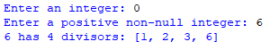

## Description
This program prompts the user for an input integer, calculates the number of divisors for that integer, and displays both the count of divisors and the list of divisors, ensuring that the input is a positive non-null integer.
## Example

